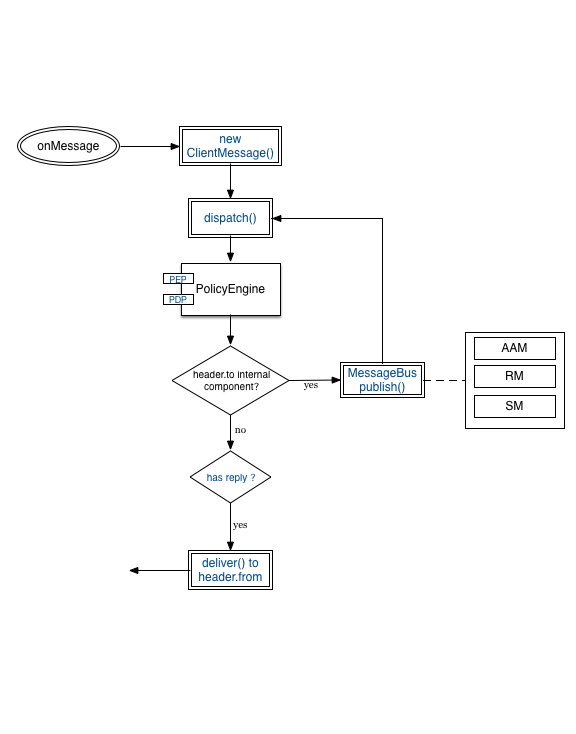

# Msg-node-nodejs-PolicyEngine
## Overview

We present below a NodeJs-based prototype of the PEP and PDP initially dedicated to the NodeJS version of the [Messaging Node developed by Apizee](https://github.com/reTHINK-project/dev-msg-node-nodejs). 

By modifying the PEP hook, it is possible to apply our approach to other versions of the Messaging Node or to other components of the reTHINK architecture requiring an authorization control framework. 

## Setting up Environment

You should follow the Setup Environment of [dev-msg-node-nodejs](https://github.com/reTHINK-project/dev-msg-node-nodejs).

## Overview of the development

This section describes the integration & deployment of the PolicyEngine into the Messaging Node architecture.

### Integration the PolicyEngine in MsgNode/Nodejs

[Here](./docs/event-mgmt.png) we have a presentation of the functional blocks of the Messaging Node architecture.

The graphic below shows where to hook the PolicyEngine Component to the core component of MsgNode.

### Global design of the prototype

The graphic below describes the relations between the Classes in the PolicyEngine and the key methods within them.

### Sequence diagram

The graphic below describes an abstract sequence diagram of the execution process among the entities.

## Policy description

Work in progress.

## References

- [the XACML policies](https://en.wikipedia.org/wiki/XACML)

- [ABAC](https://en.wikipedia.org/wiki/Attribute-Based_Access_Control)

- [A Rule Based Access Control module for hapi](https://github.com/franciscogouveia/hapi-rbac)  