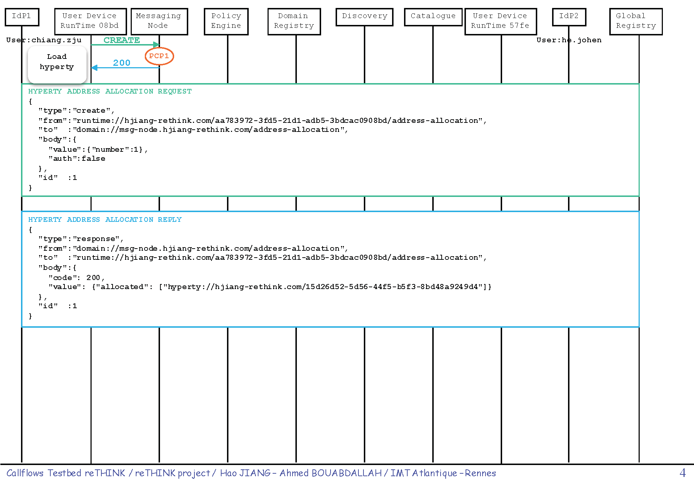
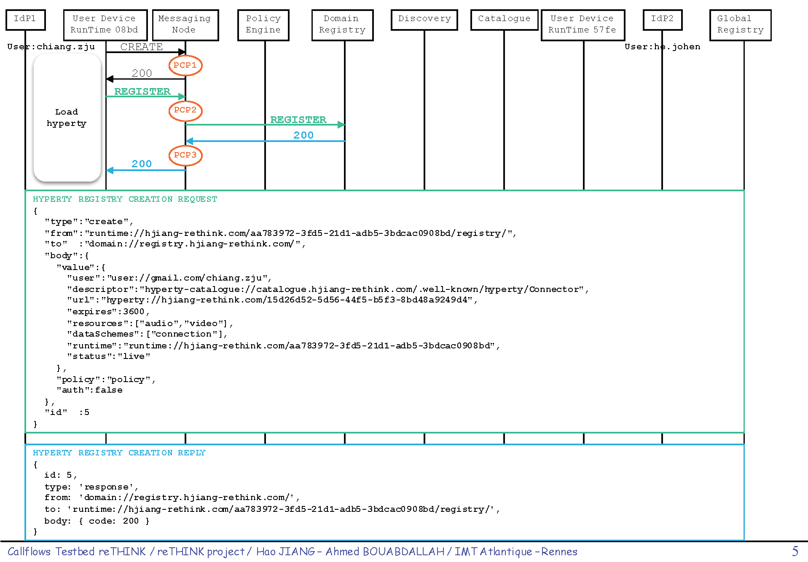

### ReTHINK Policy Examples for Nodejs Messaging Node

***

In [reThink](http://www.rethink-project.eu/), we have designed and implemented a [JSON-based policy description language (PDL)](https://github.com/Heriam/dev-msg-node-nodejs/tree/develop/src/main/components/policyEngine/prp/policy) for the policy engine deployed on the Nodejs messaging node. In this document, we further illustrate and evaluate the PDL using a set of policy examples. We choose the *Connector* hyperty for demonstration, analyse in details about the signalling messages and phases based on communication sequence diagram. As a result, we have identified for this use case a total of 33 policy control points (PCPs) available for the deployment of different policies. This document provides a concret view of the policies that could be deployed based on these PCPs.

#### ReTHINK Framework and Hyperties

Preknowledge of the concept of hyperties and the reTHINK framework is requried to understand this document. The picture below depicts the basic architecture of reTHINK within a CSP domain. We don't go into details in this section. Please find [here](https://github.com/reTHINK-project/specs) the full detailed specification of reTHINK Framework.


The connector hyperty is one of the hyperties that are available on the [reTHINK testbed](https://github.com/Heriam/reThink-testbed). It provides services like user search and WebRTC call. When running on the user device runtime, the hyperty represents for the user as a live instance providing communication services within the reTHINK framework. 

#### Message Node Functionalities and Policing Requirements 

The Node.js based Messaging Node is one of the reference implementations of the CSP Messaging services in the reTHINK Architecture. The role of Messaging Nodes in the reTHINK Architecture is described in detail in [Hyperty Messaging Framework](https://github.com/reTHINK-project/specs/blob/master/messaging-framework/readme.md). Overall, as part of CSP backend services, it interacts with other rethink CSP backend components like the CSP domain registry, CSP catalogue. 

The message node is responsible for the message delivery at domain level, which is based on a simple message router functionality that performs a lookup for listeners registered to receive the message. The message is posted to all found listeners, which can be other routers/message nodes or the final recipient end-point. Thus, the reThink messaging framework is comprised by a network of routers/message nodes where each router/message node only knows adjacent registered routers/message nodes or end-points. Meanwhile, listeners are programmatically registered and unregistered by routing management functionalities, which take their decisions according to a higher level view of the routing network.

Message nodes are responsible for the interaction of runtimes that might belong to different administrative domains by offering protocol stubs to these external runtimes. The domain operators need a mechanism to control these domain interactions and to potentially block or limit certain combinations of message exchange. In order to achieve this, a MN must provide a hook in the message flow that allows applying policy-based decisions to the routing. These policies must be manageable by the domain Policy Manager. Therefore a Policy Engine provides Policy Decision and Policy Enforcement functionalities at Domain level for incoming and outgoing messages in cooperation with authentication and authorization provided by Identity Management functionalities. It also provides authorization / access control to the Message BUS. 

Overall, the policy engine supports a message node to accomplish the following operations:

- Policy-based inter/intra domain routing. 
- Policy-based functioning and access control of the message node components and support services (including address allocation and subscription management).
- Policy-based access control of reTHINK backend services (including Domain Registry, Global Registry and Identity Management support services).

#### Connector Hyperty Communication Sequence Diagram and PCPs

In this section we analyse the connector hyperty use case step by step from the initiation to the termination of the call.

**Phase 1. Hyperty download and registration**



The first observed message is sent from the runtime to the address allocation manager of the messaging node to request for an address for the just loaded Connector hyperty. Thus the first PCP can be identified for the policy-based control (deny/permit) of this procedure on the message node. At this point, the policy for example can limit the number of requested addresses as expressed below for PCP 1.

- Example 1: For messages of *addressAllocation* type, if the actType is *create* and the requested number of addresses is more than 1, then deny.

```json
{
  "target": {"msgType": {"equals": "addressAllocation"}},
  "condition": {
    "actType": {"equals": "create"},
    "valueNumber": {"moreThan": 1}
  },
  "effect": "deny"
}
```

- Example 2: For messages of *addressAllocation* type, if the actType is *response* and the allocated number of addresses is more than 1, then permit but limit the number of allocated addresses to 1.

```json
{
  "target": {"msgType": {"equals": "addressAllocation"}},
  "condition": {
    "actType": {"equals": "response"},
    "valueAllocate": {"moreThan": 1}
  },
  "effect": "permit",
  "obligations": {"limitNumber": {"valueAllocated": 1}}
}
```



The next message is to register the new hyperty to the domain registry with all the necessary information such as its address, user url, runtime url, etc.. Some policies can be to examine the content of the registry entry, or the validity of the requested service for the given user. **Please note** that the functionality-specific policies are better to be deployed on the policy engine of the corresponding reTHINK backend component instead of the message node. For example, a policy as below should be normally deployed on the policy engine of the domain registry:

- Example 3: for messages that are of *registration* msgType and *create* actType, if the user has reached the predefined maximum number of hyperties that it can register (100 for example), or the requested resources contain *video*, or the *expires* value is larger than 3600, then deny.

```json
{
  "target": {
    "msgType": {"equals": "registration"},
    "actType": {"equals": "create"}
  },
  "condition": [
    {"userRegistries": {"moreThan": 100}},
    {"valueResources": {"contains": "video"}},
    {"valueExpires": {"moreThan": 3600}}
  ],
  "effect": "deny"
}
```

However, 