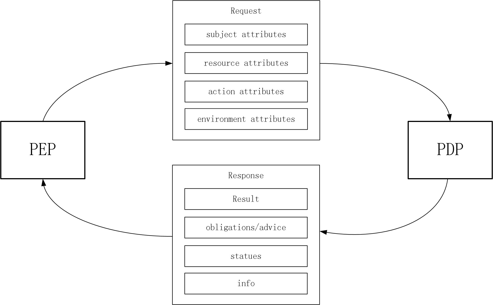
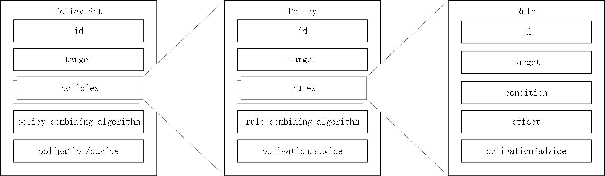

# reThink Policy Description Language

A policy describes principles or strategies for a plan of action designed to achieve a particular set of goals. We define a policy as a function that maps a series of events into a set of actions. In this section we introduce our Policy Description Language (PDL), a simple but expressive language to specify policies. PDL is specifically designed for turning the needs of access control into meaningful policies that can govern whether and where a request should be blocked, filter which elements of the returned resource it can contain, and constrain the values that can be set for properties. The reTHINK Policy Specification Language is a PDL tailored to the requirements of reTHINK framework. Policies following this language use a closed vocabulary that gives the ability to configure end user or service provider configurations in an expressive and flexible way.

## Background

The reThink project defines a PEP/PDP model for its [policy engines](../../readme.md). As shown in Figure 1, upon the interception of a message, the PEP analyzes it and collects necessary attributes into a authorization request to PDP. The PDP then gets the right policies for the request from a database remotely or locally, evaluates the attributes against the policies, and finally responds with a decision such as *permit*, *deny*, *not applicable*, or *indeterminate*. 



**Figure 1:** PEP-PDP interaction

- A **request** normally contains four kinds of attributes such as Subject, Resource, Action, and Environment. Subject attribute contains subject's details such as name, e-mail, role and so on. Resource attribute details the resource for which access is requested and action attribute specifies the requested action to be performed on resource such as read or write. Also, Environment attribute is optional and contains attributes of environment.
- A **response** represents the authorization decision information made by PDP. It contains one or more result attributes. Each result includes a decision such as permit, deny, notApplicable, or indeterminate. In addition, there might some status information which gives the errors occurred and their descriptions while evaluating the request and optionally one or more obligations which specifies tasks in the policySet and policy elements in the policy description which should be performed before or after granting or denying access.

## PDL Structure

The reThink PDL contains three structural elements, namely Policy Set, Policy, and Rule. The fields of each element and the relationships between them are presented in Figure 2. 



**Figure 2:** Policy Language Structure

- A **rule** element defines the target elements to which the rule is applied and details conditions to apply the rule and has three components such as target, effect, and condition. A target element specifies the resources, subjects, actions and the environment to which the rule is applied. A condition element shows the conditions to apply the rule and a effect is the consequence of the rule as either permit or deny. 
- A **policy** is the set of rules which are combined with some algorithms. These algorithms are called rule-combining algorithms. For instance "Permit Override" algorithm allows the policy to evaluate to "Permit" if any rule in the policy evaluates to "Permit". A policy also contains target elements which shows the subjects, resources, actions, environment that policy is applied.
- A **policy set** consists of Policies combined with policy-combined algorithm. It has also target like a Policy.

## PDL Syntax

Policies are expressed in JSON format with a set of key-value pairs. Following the PDL structure as mentioned above, the policies are formatted with three layers respectively: the outmost PolicySets, the inner Policies, and the innermost Rules. 

### Policy Sets, Policies, and Rules

As shown in Figure 3, for a specific PolicySet, an **id** is given in order to uniquely identify it, and a **version** field shows the current version of this PolicySet. The **update** field indicates the timestamp of last update. A **target** defines a simple Boolean condition that, if satisfied (evaluates to True) by the attributes of the request, establishes the need for subsequent evaluation against the **policies** in this set. If no target matches the request, the decision then would be *not applicable*, and if the target condition evaluates to True for and the policies of this set fails to evaluate for any reason, the result of this policy set would be *indeterminate*. The **priority** field specifies the weight of current policy set compared to others. The **obligations** specifies tasks that should be performed before or after granting or denying access.

```json
{
  "id": "<id>",
  "version": "<version>",
  "update": "<update timestamp>",
  "target": "<boolean condition>",
  "policies": "[<policy1>, <policy2>, ...]",
  "policyCombiningAlgorithm": "<algorithm>",
  "obligations": "[<task1>, <task2>, ...]",
  "priority": "<priority>"
}
```

**Figure 3:** PolicySet syntax

Each policy, as show in Figure 4, contains id, target, priority, and obligations fields like policy set. Similarly, it contains a set of rules and combining algorithm for the evaluation of attributes contained in the request. 

```json
{
  "id": "<id>",
  "target": "<boolean condition>",
  "rules": "[<rule1>, <rule2>, ...]",
  "ruleCombiningAlgorithm": "<algorithm>",
  "obligations": "[<task1>, <task2>, ...]",
  "priority": "<priority>"
}
```

**Figure 4:** Policy syntax

As show in Figure 5, in addition to a target, a rule includes one or a combination of Boolean conditions that, if evaluated true, have an effect of either Permit or Deny, otherwise the effect is not taken. If the target condition evaluates to True for a Rule and the Rule’s condition fails to evaluate for any reason, the effect of the Rule is Indeterminate. In comparison to the (matching) condition of a target, the conditions of a Rule or Policy are typically more complex and may include functions (e.g., "greater-than", "less-than", "equal") for the comparison of attribute values, and operations (e.g., "not", "and", "or") for the computation of Boolean values.

```json
{
  "id": "<id>",
  "target": "<boolean condition>",
  "condition": "<condition>",
  "effect": "<effect>",
  "obligations": "[<task1>, <task2>, ...]",
  "priority": "<priority>"
}
```

**Figure 5:** Rule syntax

### Operators and Attributes

In a rule entry of a policy, the condition field represents the restriction under which the rule could be applied. When the policy engine examines a message, it firstly looks for the predefined policy for the message, and then compares the message against the policy rule by rule using the condition field. As depicted in the previous section, the conditions can be expressed using as many kinds of attributes as possible in order to achieve strong flexibility, expressiveness and functionality such as time, weekday, source of the message, domain, and so on. The Table 1 below lists all the supported condition attributes. 

| Attribute      | Description                              | Expected Parameter                       |
| -------------- | ---------------------------------------- | ---------------------------------------- |
| srcUsername    | username of the source of the message    | String, a valid email. e.g., alice@gmail.com |
| srcRuntime     | runtime of the source of the message     | String, a valid runtime url. e.g., runtime://hjiang-rethink.com/046f2989-d1d7-cb82-74fa-92088436dce4 |
| srcHyperty     | hypertyURL of the source of the message  | String, a valid hyperty url. e.g., hyperty://hjiang-rethink.com/2ada7f7a-e395-45a3-86c8-3f9c07451d40 |
| srcIDPDomain   | ID domain of the source user of the message | String, a valid id domain. e.g., gmail.com  |
| srcSPDomain    | service domain of the source of the message     | String, a valid service domain.        |
| srcScheme      | data object scheme                       | String, a valid data object scheme. e.g., connection |
| msgFrom        | source url of the message                | String, a valid url. e.g., domain://registry.hjiang-rethink.com/ |
| srcIDP         | identity provider of the source of the message | String, a valid idp                      |
| msgTo          | destination url of the message           | String, a valid url. e.g., domain://registry.hjiang-rethink.com/ |
| dstSPDomain    | service domain of the recipient of the message   | String, a valid domain. e.g., gmail.com  |
| dstScheme      | data object scheme                       | String, a valid data object scheme. e.g., connection |
| dstUsername    | username of the recipient of the message    | String, a valid email. e.g., alice@gmail.com |
| dstRuntime     | runtime of the recipient of the message     | String, a valid runtime url. e.g., runtime://hjiang-rethink.com/046f2989-d1d7-cb82-74fa-92088436dce4 |
| dstHyperty     | hypertyURL of the recipient of the message  | String, a valid hyperty url. e.g., hyperty://hjiang-rethink.com/2ada7f7a-e395-45a3-86c8-3f9c07451d40 |
| actType     | type of action                           | String. e.g., open, create, update, etc. |
| resource       | targeted resource                        | String, a valid resource. e.g., an user |
| auth           | authorization status                     | Boolean, true or false                   |
| msgId          | id of the message                        | Number, a valid integer. e.g., 1         |
| msgType        | type of the message                      | String, a valid message type. e.g., registration |
| time           | time of the day, HH:mm:ss                | String, a valid time. e.g., 12:30:00     |
| date           | date of the year, YYYY-MM-DD             | String, a valid date. e.g., 1992-10-23   |
| weekday        | day of the week                          | String, a valid weekday. e.g., Sunday    |
| domain         | service domain url of the messaging node | String, a valid url. |
| domainRegistry | registry url of the domain               | String, a valid url. |
| port           | the port of the messaging node           | Number, a valid port number. e.g., 9090 |
| useSSL         | if using ssl                             | Boolean, true of false                 |
| valueNumber    | number in the value field of message body| Number, a valid interger. e.g., 1      |
| valueAllocated | allocated addresses in the value field   | List, a list of valid hyperty addresses. |
| userRegistries | registries associated to the user        | List, a list of user registries        |

**Table 1:** Attributes

The type of operation to do to verify an attribute value against a given parameter defined in policy is done through the operators such as "equals", "moreThan", "lessThan", etc... The operation keyword of the condition states how the evaluation of the policy must deal with the system attribute and its parameter independently of what the system attribute is. For instance, the operation may verify if the system attribute is equal to the parameter, if it is part of a collection, or if its value is greater than or less than the parameter. The Table 2 presents operations supported by the policy engine.

| Operator | Description                              |
| -------- | ---------------------------------------- |
| in       | Verifies if a given value is part of a collection |
| equals   | Verifies if a given value is equal to other |
| moreThan | Verifies if a given value is greater than the other |
| lessThan | Verifies if a given value is less than the other |
| between  | Verifies if a given value (including time) is within a scope |
| contains | Verifies if a given collection contains a value |
| like     | Verifies if a given string fulfils a specific pattern using wildcards (one or more "*") |

**Table 2:** Operators

### Targets and Conditions

reThink PDL defines a notion of *Attribute Condition*, which is a simple Boolean condition consists of exactly an attribute, at least an operator and one or more parameters. It defines the condition that the message has to fulfil with respect to a specific attribute. Multiple *Attribute Conditions* can be integrated into a more complex condition with logical operations such as *not, anyOf, allOf*. The notion of *Attribution Condition* is used in both *Target* and *Condition* fields in the reThink PDL.

***Attribute Condition***

Attribute Condition follows the syntax as below:

```json
{"<attribute>": "<condition expression>"}
```

The *condition expression* is an expression consists of operators and parameters which defines specifically the requirements that the attribute value of the message has to meet. The simplest format of the expression could be:

```json
{"<operator>": "<parameter>"}
```

However, there are also cases that we may need multiple constrains (operator-parameter pairs)  for the same attribute, with logical relationships such as *and, or, not*. Respectively, we use keywords such as *allOf, anyOf* and *not* to indicate these relations. To simplify this, we also define that by default operator-parameter pairs in the same map are of *and* relationship, while the ones in the same array are of *or* relationship, so that in most cases that the keywords can be omitted.

- *OR Logic*:

  e.g., expression1 *or* expression2:

  ```json
   {
     "anyOf": [
       {"<operator1>": "<parameter1>"},
       {"<operator2>": "<parameter2>"}
     ]
   }
  ```

  Simplification:

  ```json
   [
     {"<operator1>": "<parameter1>"},
     {"<operator2>": "<parameter2>"}
   ]
  ```

  Specifically, if a complex expression contains multiple operator-parameter pairs with *or* relationship having the same operator:

  ```json
   [
     {"<operator1>": "<parameter1>"},
     {"<operator1>": "<parameter2>"},
     {"<operator1>": "<parameter3>"}
   ]
  ```

   then it can be further simplified as:

  ```json
   {"<operator1>": ["<parameter1>", "<parameter2>", "<parameter3>"]}
  ```

- *AND Logic*:

  e.g., expression1 *and* expression2:

  ```json
  {
    "allOf": [
      {"<operator1>": "<parameter1>"},
      {"<operator2>": "<parameter2>"}
    ]
  }
  ```

  Simplification:

  ```json
  {
    "<operator1>": "<parameter1>",
    "<operator2>": "<parameter2>"
  }
  ```

  Please note that we do not provide any further simplification for a complex expression that contains multiple operator-parameter pairs with *and* relationship having the same operator, i.e., there is no further simplified syntax for expression:

  ```json
  {
    "<operator1>": "<parameter1>",
    "<operator1>": "<parameter2>",
    "<operator1>": "<parameter3>"
  }
  ```

- *NOT Logic*:

  e.g., *not* expression1:

  ```json
  {
    "not": {"<operator1>": "<parameter1>"}
  }
  ```

Therefore, an *Attribute Condition* could be simple but flexible and expressive as below for example. Please note that the attribute keywords are marked with "<>". Also note that the value of another attribute can be used as a parameter for the condition. As the attribute "dstScheme" shown below, it is used as a parameter in the "srcScheme" *Attribute Condition*. And when the policy is evaluated, PDP would first get the value of the "dstScheme" attribute from the message, and then compare the value with "srcScheme" attribute.

```json
{"<srcScheme>": {
                "in": ["connection", "hyperty"],
                "equals": "<dstScheme>"
                }
}
```

***Complex Condition***

A *Complex Condition* contains constrains in multiple attributes. Similar to *Attribution Condition*, we use keywords *not*, *anyOf*, and *allOf* to indicate logical relations and also support simplifications.

- *OR Logic*:

  e.g., attributeCondition1 *or* attributionCondition2:

  ```json
  {
    "anyOf": [
      {"<attribute1>": "<expression1>"}, {"<attribute2>": "<expression2>"}
    ]
  }
  ```

  Simplification:

  ```json
  [{"<attribute1>": "<expression1>"}, {"<attribute2>": "<expression2>"}]
  ```

- *AND Logic*:

  e.g., attributeCondition1 *and* attributeCondition2:

  ```json
  {
    "allOf": [
      {"<attribute1>": "<expression1>"}, {"<attribute2>": "<expression2>"}
    ]
  }
  ```

  Simplification:

  ```json
  {
    "<attribute1>": "<expression1>",
    "<attribute2>": "<expression2>"
  }
  ```

- *NOT Logic*:

  e.g., *not* attributeCondition1:

  ```json
  {
    "not": {"<attribute1>": "<expression1>"}
  }
  ```

Both *Target* and *Condition* fields can be actually expressed following the syntax described above. Normally, *Target* field uses a simple *Attribute Condition* to specify the scope of the policy rules, while *Condition* field is typically more complex and may use *Complex Conditions*.

### Combining Algorithms

Because a policy may contain multiple rules, and a policy set may contain multiple policies or policy sets, each rule, policy, or policy set may evaluate to different decisions (permit, deny, not applicable, or indeterminate). reThink PDL provides a way of reconciling the decisions each makes. This reconciliation is achieved through a collection of combining algorithms. Each algorithm represents a different way of combining multiple local decisions into a single global decision. There are several combining algorithms, to include the following:

- Deny-overrides: if any decision evaluates to Deny, or no decision evaluates to Permit, then the result is Deny. If all decisions evaluate to Permit, the result is Permit.
- Permit-overrides: if any decision evaluates to Permit, then the result is Permit, otherwise the result is Deny.
- First-applicable: the rules are evaluated following the order given by the priority field, and the decision of the first that applies (either deny or allow), is the final result of the policy evaluation.

Combining algorithms are applied to rules in a Policy and Policies within a policy set in arriving at an ultimate decision of the PDP. Combining algorithms can be used to build up increasingly complex policies. For example, given that a subject request is Permitted (by the PDP) only if the aggregate (ultimate) decision is Permit, the effect of the Permit-overrides combining algorithm is an “OR” operation on Permit (any decision can evaluate to Permit), and the effect of a Deny-overrides is an “AND” operation on Permit (all decisions must evaluate to Permit).

### Obligations and Advice

The reThink PDL includes the concepts of obligation and advice expressions. An obligation optionally specified in a Rule, Policy, or PolicySet is a directive from the PDP to the Policy Enforcement Point (PEP) on what must be carried out before or after an access request is approved or denied. Advice is similar to an obligation, except that advice may be ignored by the PEP. A few examples include:

- If Alice is denied access to document X: email her manager that Alice tried to access document X.
- If a user is denied access to a file: inform the user why the access was denied.
- If a user is approved to view document X: watermark the document “DRAFT” before delivery.


## PDL Example

For a better understanding, Figure 6 gives an example of a policy set in JSON. 
In order to further analyze and evaluate our PDL, based on the *Connector* hyperty, a set of policy control points(PCPs) and policy examples are identified and illustrated in detail [here](./ReTHINK%20Policy%20Examples%20for%20Nodejs%20Messaging%20Node.md).

```json
[{
  "id": 1,
  "version": 1,
  "update" : "2017-03-14 17:18:31",
  "target": {},
  "policyCombiningAlgorithm": "allowOverrides",
  "obligations": {"permit": {"info": "determines to permit"}},
  "priority": 0,
  "policies": [
    {
      "id": 1,
      "target": {},
      "ruleCombiningAlgorithm": "blockOverrides",
      "priority": 0,
      "obligations": {"deny": {"info": "determines to deny"}},
      "rules": [
        { "id": 1,
          "target": {},
          "condition": {"<srcIDP>":{"equals":"google.com"}},
          "effect": "permit",
          "obligations": {"info": "determines to permit"},
          "priority": 0
        },
        { "id": 2,
          "target":{},
          "condition": {"<srcScheme>":{"equals": ["hello","runtime"]}},
          "effect": "deny",
          "obligations": {"info": "determines to deny"},
          "priority": 0
        }
      ]
    },
    {
      "id": 2,
      "target": {},
      "ruleCombiningAlgorithm": "allowOverrides",
      "priority": 0,
      "obligations": {"permit": {"info": "determines to permit"}},
      "rules": [
        { "id": 1,
          "target": {"<srcIDPDomain>": {"equals": "gmail.com"}},
          "condition": [
            {
              "<weekday>": {"not": {"in": ["saturday", "sunday"]}},
              "<time>": {"between": ["06:00:00 12:30:00", "13:00:00 23:00:00"]}
            },
            {
              "<weekday>": {"in": ["saturday", "sunday"]},
              "<time>": {"between": ["07:00:00 12:00:00", "13:30:00 22:30:00"]}
            }
          ],
          "effect": "deny",
          "obligations": {"info": "determines to deny"},
          "priority": 0
        },
        { "id": 2,
          "target":{"<actionType>": {"in": ["create","update","open","subscribe","response", "handshake"]}},
          "condition": {"<srcUsername>": {"like": "*@gmail.com"}},
          "effect": "deny",
          "obligations": {"info": "determines to deny"},
          "priority": 0
        },
        { "id": 3,
          "target":{},
          "condition": {"<msgType>": {"in": ["registration","addressAllocation","discovery","globalRegistry","identityManagement","dataSync","p2pConnection"]}},
          "effect": "permit",
          "obligations": {"info": "determines to permit"},
          "priority": 0
        },
        { "id": 4,
          "target":{},
          "condition": {"<srcScheme>":{"in": ["hello","<dstScheme>"]}},
          "effect": "permit",
          "obligations": {"info": "determines to permit"},
          "priority": 0
        },
        { "id": 5,
          "target":{},
          "condition": [],
          "effect": "permit",
          "obligations": {"info": "determines to permit"},
          "priority": 0
        }
      ]
    }
  ]
}]
```

**Figure 6:** Policy example

## References

- [Policy Engine in the Node.js Messaging Node of reThink](../../readme.md)
- [Policy Description Language in the Runtime of reThink](https://github.com/reTHINK-project/specs/blob/master/policy-management/policy-specification-language.md)
- [ReTHINK Policy Examples for Nodejs Messaging Node](./ReTHINK%20Policy%20Examples%20for%20Nodejs%20Messaging%20Node.md)


