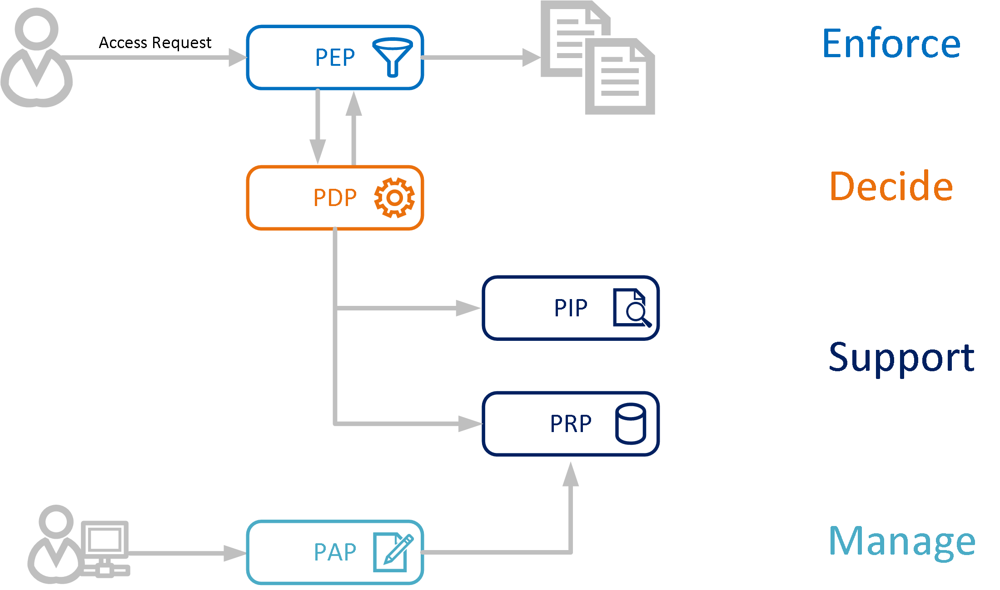

# Policy Engine Overview
We present in this section the general architecture of a policy engine, which normally consists of the following components:

-  **Policy Enforcement Point**

   In the reThink framework, the PEP is the component in charge of intercepting communication messages and protecting targeted resources by requesting an authorization decision from a Policy Decision Point (PDP) and enforcing that decision. 

- **Policy Decision Point**

   The PDP sits at the very core of the policy engine architecture. It implements the policy description language and evaluation logic. Its purpose is to evaluate authorization requests coming from the PEP against the policies loaded from the Policy Retrieval Point (PRP). The PDP then returns a decision – either of Permit, Deny, Not Applicable, or Indeterminate.

- **Policy Retrieval Point**

   The PRP is one of the components that support the PDP in its evaluation process. Its only purpose is to serve as a persistence layer for reThink policies. It can therefore take many forms such as a database, a file, or a web service call to a remote repository.

- **Policy Information Point**

   The [Policy Description Language (PDL)](./prp/policy/readme.md) of reThink uses attributes to express rules & conditions. Attributes are bits of information about a subject, resource, action, or context describing an access control situation.  Examples of attributes are a user id, a role, a resource URI, a document classification, the time of the day, etc… In its evaluation process, the PDP may need to retrieve additional attributes. It turns to PIPs where attributes are stored. Examples of PIPs include corporate user directories (LDAP…), databases, UDDIs… The PDP may for instance ask the PIP to look up the role of a given user.

- **Policy Administration Point**

   The PAP’s purpose is to provide a management interface that administrators can use to author policies and control their lifecycle.

   ​

   

   ​

# Policy Engine Implementation

We present below a policy engine developed by Institute Mines-Telecom/Telecom Bretagne. The policy engine follows PEP/PDP architecture, and is currently implemented in the [Node.js-based messaging node](https://github.com/reTHINK-project/dev-msg-node-nodejs) of [reThink project](https://github.com/reTHINK-project). However, By simply invoking the interface of PEP, it is possible to migrate the policy engine to other components of the reTHINK architecture. 

The figure below below gives the sequence diagram illustrating interaction patterns between different components.

Please note that reTHINK project defines a remote repository to globally maintain and store policies within a CSP domain, as shown in the upper left of the picture below, which is currently not implemented. The PEP/PDP as shown in the lower right is the policy engine hooked to the messaging node.

Please refer to [here](https://github.com/Heriam/dev-msg-node-nodejs/blob/master/readme.md) for information about the Node.js-based messaging node. The figure below gives the position of the invocation of the policy engine in the message event processing among components in the messaging node. As shown in the figure, each new message would be intercepted by the policy engine, and then be passed or blocked according to the decision made by PDP.

# Policy Description Language

- [Policy Description Language](./prp/policy)

  ​

# Developer Guide

- [reThink Testbed Setup](https://github.com/Heriam/reThink-testbed/tree/dev-tb)

- [Node.js Messaging Node Setup](https://github.com/reTHINK-project/dev-msg-node-nodejs)

  ​

# References

- [reThink Project Homepage](https://rethink-project.eu/)
- [reThink Project Github](https://github.com/reTHINK-project)
- [IMT-TB reThink Testbed](https://github.com/Heriam/reThink-testbed/tree/dev-tb)
- [A Rule Based Access Control module for hapi](https://github.com/franciscogouveia/hapi-rbac)